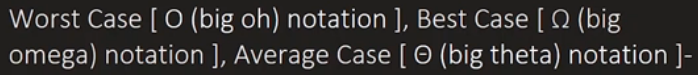
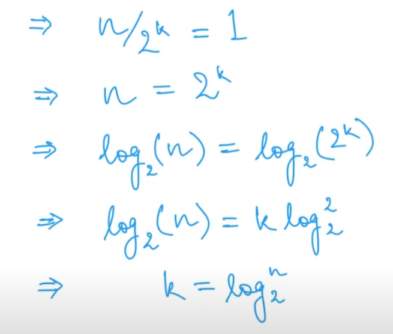

# CP-Problem

### Patterns
- Pascal Triangle 
- 

### Time Complexity 

<details>
<summary> Log n </summary>

.png)

</details>

<details>
<summary> nlog(n) </summary>

_1.png)
_2.png)

</details>

<details>
<summary> sqrt(n) vs log(n) </summary>

_2.png)
</details>

### Space Complexity 


## Data Structure

### Array & Vector

```
// Basic Vector functions
#include <vector>
vector <int> v;
vector <int> v2 (3, 50);    // Vector w/ 3 elements (50, 50, 50)

v.push_back(ele);   // Add element
v.pop_back();       // Remove last Element


swap(v, v2);                        // Swap the values between two vectors
sort(v.begin(), v.end());           // Sort


```

```
// Iterating throught a vector

// M1
for(int i =0; i<v.size();i++)
        cout << v[i] << endl;

// M2
vector <int>:: iterator it;
for(it=v.begin(); it!=v.end(); it++) {
    cout << *it << endl;
}


// M3 
for(auto element:v) {
    cout << element << endl;
}

```


## Algorithm 

### Searching and Sorting 



 

<details> 
<summary> Selection Sort </summary> 

```
    for(int i=1; i<n; i++) {
        int current = arr[i];
        int j=i-1;
        while(arr[j] > current && j>=0) {
            arr[j+1] = arr[j];
            j--;
        }
        arr[j+1] = current;
    }
```
</details>

<details> 
<summary> Bubble Sort </summary> 

- Check if the i-th element is larger than (i+1)-th element. Then Again we compare the element upto the 2nd last element

```
    int ctr = 1;
    while(ctr < n) {
        for(int i =0; i<n-ctr; i++) {
            if(arr[i] > arr[i+1]) {
                int temp = arr[i];
                arr[i] = arr[i+1];
                arr[i+1] = temp;
            }
        }
        ctr++;
    }
```
</details>

<details> 
<summary> Insertion Sort </summary> 

```
    for(int i=1; i<n; i++) {
        int current = arr[i];
        int j=i-1;
        while(arr[j] > current && j>=0) {
            arr[j+1] = arr[j];
            j--;
        }
        arr[j+1] = current;
    }
```
</details>